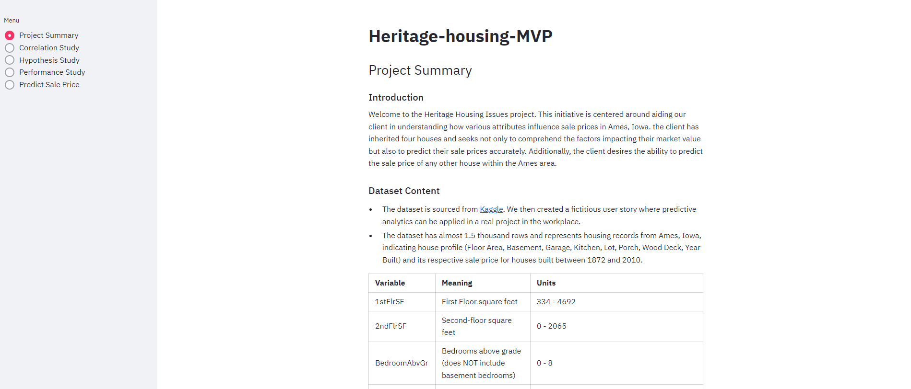

# Heritage Housing Issues
"Am i Responsive"
<>

## Project Overview
### Project Objective

The primary objective of this project was to analyze house attributes and their correlation with sale prices, and to develop a
predictive model for estimating the sale prices of houses in Ames, Iowa. This included predicting the sale prices of four houses that client inherited as well as any other houses in the area. An ML regressor modeling was necessary and a dashboard was built with the help of streamlit. The application is live at: [https://heritage-housing-app-f62d499d61cc.herokuapp.com/]

## Dataset Content

* The dataset is sourced from [Kaggle](https://www.kaggle.com/codeinstitute/housing-prices-data). We then created a fictitious user story where predictive analytics can be applied in a real project in the workplace.
* The dataset has almost 1.5 thousand rows and represents housing records from Ames, Iowa, indicating house profile (Floor Area, Basement, Garage, Kitchen, Lot, Porch, Wood Deck, Year Built) and its respective sale price for houses built between 1872 and 2010.

|Variable|Meaning|Units|
|:----|:----|:----|
|1stFlrSF|First Floor square feet|334 - 4692|
|2ndFlrSF|Second-floor square feet|0 - 2065|
|BedroomAbvGr|Bedrooms above grade (does NOT include basement bedrooms)|0 - 8|
|BsmtExposure|Refers to walkout or garden level walls|Gd: Good Exposure; Av: Average Exposure; Mn: Minimum Exposure; No: No Exposure; None: No Basement|
|BsmtFinType1|Rating of basement finished area|GLQ: Good Living Quarters; ALQ: Average Living Quarters; BLQ: Below Average Living Quarters; Rec: Average Rec Room; LwQ: Low Quality; Unf: Unfinshed; None: No Basement|
|BsmtFinSF1|Type 1 finished square feet|0 - 5644|
|BsmtUnfSF|Unfinished square feet of basement area|0 - 2336|
|TotalBsmtSF|Total square feet of basement area|0 - 6110|
|GarageArea|Size of garage in square feet|0 - 1418|
|GarageFinish|Interior finish of the garage|Fin: Finished; RFn: Rough Finished; Unf: Unfinished; None: No Garage|
|GarageYrBlt|Year garage was built|1900 - 2010|
|GrLivArea|Above grade (ground) living area square feet|334 - 5642|
|KitchenQual|Kitchen quality|Ex: Excellent; Gd: Good; TA: Typical/Average; Fa: Fair; Po: Poor|
|LotArea| Lot size in square feet|1300 - 215245|
|LotFrontage| Linear feet of street connected to property|21 - 313|
|MasVnrArea|Masonry veneer area in square feet|0 - 1600|
|EnclosedPorch|Enclosed porch area in square feet|0 - 286|
|OpenPorchSF|Open porch area in square feet|0 - 547|
|OverallCond|Rates the overall condition of the house|10: Very Excellent; 9: Excellent; 8: Very Good; 7: Good; 6: Above Average; 5: Average; 4: Below Average; 3: Fair; 2: Poor; 1: Very Poor|
|OverallQual|Rates the overall material and finish of the house|10: Very Excellent; 9: Excellent; 8: Very Good; 7: Good; 6: Above Average; 5: Average; 4: Below Average; 3: Fair; 2: Poor; 1: Very Poor|
|WoodDeckSF|Wood deck area in square feet|0 - 736|
|YearBuilt|Original construction date|1872 - 2010|
|YearRemodAdd|Remodel date (same as construction date if no remodelling or additions)|1950 - 2010|
|SalePrice|Sale Price|34900 - 755000|

## Business Requirements

As a good friend, you are requested by your friend, who has received an inheritance from a deceased great-grandfather located in Ames, Iowa, to  help in maximising the sales price for the inherited properties.

Although your friend has an excellent understanding of property prices in her own state and residential area, she fears that basing her estimates for property worth on her current knowledge might lead to inaccurate appraisals. What makes a house desirable and valuable where she comes from might not be the same in Ames, Iowa. She found a public dataset with house prices for Ames, Iowa, and will provide you with that.

* 1 - The client is interested in discovering how the house attributes correlate with the sale price. Therefore, the client expects data visualisations of the correlated variables against the sale price to show that.
* 2 - The client is interested in predicting the house sale price from her four inherited houses and any other house in Ames, Iowa.

## Hypothesis and how to validate?

* H1 - Hypothesis 1: Quality of Interior Features and Sale Price
* Null Hypothesis (H₀): The quality of interior features (e.g., kitchen quality, overall material and finish) does not significantly impact the sale price of houses in Ames, Iowa.

* Alternative Hypothesis (H₁): Houses with higher-quality interior features command higher sale prices in Ames, Iowa.

* Rationale: This hypothesis examines whether aspects such as the condition of the kitchen, the quality of materials used throughout the house, and the overall finish of interior spaces correlate with higher sale prices. These features are often significant factors in buyer decisions.

* Findings from the Notebook:

* The analysis identified variables such as OverallQual (Overall Quality) and KitchenQual (Kitchen Quality) as strongly correlated with higher sale prices.
Specifically, houses with excellent kitchen quality (KitchenQual_Ex) and higher overall quality (OverallQuality) tend to command higher sale prices.
Conclusion:

* The findings support Hypothesis 1. There is evidence that the quality of interior features, particularly kitchen quality and overall quality, correlates positively with sale prices in Ames, Iowa.

* Null Hypothesis (H₀): The size and functional space utilization of a house do not significantly affect its sale price in Ames, Iowa.

* Alternative Hypothesis (H₁): Larger houses with efficiently utilized functional space tend to have higher sale prices in Ames, Iowa.

* Rationale: This hypothesis explores whether the physical size of a house and how well its functional spaces are utilized influence its market value. Buyers often prioritize ample living space and well-designed functional areas.

* Findings from the Notebook:

* Variables such as GrLivArea (Above Ground Living Area), GarageArea, TotalBsmtSF (Total Basement Area), and 1stFlrSF (First Floor Area) were identified as influential factors positively correlated with sale prices.
Larger sizes in these functional spaces generally lead to higher sale prices.
* Conclusion:
 The analysis supports Hypothesis 2. Larger sizes in functional spaces like living area, garage, basement, and first floor correlate positively with higher sale prices in Ames, Iowa.

## ML Business Case

**Objective:**

To analyze and predict house sale prices in Ames, Iowa, with a focus on maximizing the sale prices of 4 inherited houses through data analysis and machine learning.

**Business Requirements:

1. Identify Correlated Variables:
    * Investigate and visualize the correlation between house attributes and sale prices.
    * Summarize insights from data visualizations to determine the most relevant variables affecting house prices.

2. Predict Sale Prices:
    * Develop an ML model to predict sale prices for 4 inherited houses and any other house in Ames, Iowa.
    * Ensure the model achieves a minimum R2 score of 0.75 on both the train and test sets.

3. Dashboard Development:
    * Create a dashboard that includes:
        * Project summary with dataset and client requirements.
        * Findings on Feature correlations with house sale prices.
        * Predicted sale prices of the 4 inherited houses with interactive widgets for real-time predictions.
        * Hypothesis validation and project insights.
        * Technical details of model performance and pipeline steps.

**Epics and User Stories:**
1. Informationg Gathering and Data Collection:
    * User Story 1.1: As a data scientist, I want to collect the housing dataset from the provided public data source, so that I have the necessary information for analysis.
    * User Story 1.2: As a data scientist, I want to explore the dataset to understand the types of attributes available, their distributions, and any potential anomalies, so that I can plan the data cleaning and preparation steps effectively.
2. Data Visualizations, Cleaning, and Preparation:
    * User Story 2.1: As a data scientist, I want to clean dataset by handling missing values, outliers, and inconsistencies so that the data is ready for analysis and modeling.
    * User Story 2.2: As a data scientist, I want to create new features or transform existing features based on domain knowledge and data patterns so that the model has more relevant inputs.
    * User Story 2.3: As a data scientist, I want to visualize the relationships between different house attributes and the sale price ranges so that I can identify important features for the regression model.
3. Model Training, Optimization, and Validation:
    * User Story 3.1: As a data scientist, I want to select appropriate regression algorithms, so that I can build a model that predicts house sale prices accurately.
    * User Story 3.2: As a data scientist, I want to train regression model using historical housing data, so that the model can learn to predict house sale prices based on house attributes.
    * User Story 3.3: As a data scientist, I want to evaluate the regression models using appropriate metrics, so that I can assess the accuracy and reliability of the predictions.
    * User Story 3.4: As a data scientist, I want to optimize the regression models through hyperparameter tuning and cross-validation, so that the models achieve the best possible performance.
    * User Story 3.5: As a data scientist, I want to validate the optimized models on a separate test dataset, so that I can ensure the models generalize well to unseen data.
4. Dashboard Planning, Designing, and Development:
    * User Story 4.1: As a data scientist, I want to develop the dashboard using Streamlit, so that the client has a robust and functional interface for interacting with the regression model predictions.
5. Dashboard Deployment and Release:
    * User Story 5.1: As a data scientist, I want to deploy the dashboard on a cloud platform or server, so that the client can access it from any device.
    * User Story 5.2: As a data scientist, I want to create user documentation for the dashboard, so that the client knows how to effectively use the features and interpret the predictions.

## Dashboard Design

### Navigation

Each dashboard app page features a sidebar, that allows navigation between the various app pages via radio inputs.

### Project Summary Page

This page provides an overview of the Heritage Housing Issues project, including:

* **Introduction:** Brief description of the project's goal to understand and predict house sale prices in Ames, Iowa.
* **Dataset Content:** Information about the dataset used, sourced from Kaggle, detailing house attributes and sale prices.
* **Business Requirements:** The client's two main requirements:
    1. Understanding how house attributes correlate with sale prices.
    2. Predicting sale prices for inherited houses and other houses in Ames.
* **README:** A link to the project's README file for additional information.

### Correlation Study Page

This page presents the correlation analysis and exploratory data analysis (EDA) for the Heritage Housing Issues project. It includes:
* Data Loading and Preprocessing
    * Loading and cleaning the housing dataset.
    * Appyling OneHotEncoding to categorical variables.
* Correlation Calculations:
    * Computing Spearman, Pearson, and Predictive Power Score (PPS) correlations.
* Heatmaps:
    * Visualizations of correlations using heatmaps for Spearman, Pearson, and PPS correlations.
* Exploratory Data Analysis (EDA):
    * Scatter plots of key numerical variables against SalePrice.
    * Box plots of key categorical variables against SalePrice.
* Key Insights:
    * Identification of the most correlated variables with SalePrice.
    * Detailed analysis and visualizations providing insights into how specific attributes correlate with house sale prices.

This analysis helps address the client's requirement to understand how house attributes correlate with sale prices, forming a foundational step towards accurate price prediction.

### Hypotheses Page

The streamlit page contains the validation of two hypotheses about hosue prices in Ames, Iowa:

1. Hypothesis 1: Quality of Interior Features
    * Conclusion: Higher quality interior features, especially kitchen quality and overall quality, increase sale prices.
2. Hypothesis 2: Size and Functional Space
    * Conclusion: Larger houses with well-utilized functional spaces (living area, garage, basement, first floor) have higher sale prices.

**Additional insights:**
* Visual and statistical analyses confirm these relationships.
**Final Asssessment:**
* Both hypotheses are supported, providing valuable insights for predicting house sale prices.

### Performance Page

The streamlit application page focuses on evaluating and presenting the performance of a machine learning pipeline designed to predict house prices.

1. Data Overview:
    * Displays the structure of both training and test datasets used in the machine learning pipeline.
2. Model Performance Metrics:
    * Evaluates the regression model's performance using metrics such as R2 score, Mean Absolute Error, Mean Squared Error, and Root Mean Squared Error. The model meets the specified criterion of R2 = 0.75 on both training and test sets.
3. Feature Importance:
    * Visualizes the importance of features used in the model with an image plot.
4. ML Pipeline Details:
    * Shows the steps of the machine learning pipeline used for predicting house prices.
5. Conclusion:
    * Summarizes the project's methodology, including data cleaning, feature engineering, and model optimization using GridSearchCV. It highlights the selection of the Extra Trees Regressor as the best-performing model and emphasizes the significance of feature selection and model tuning in achieving high predictive accuracy.

Overall, the page demonstrates the effectiveness of a systematic approach in developing a robust machine learning pipeline for real-world regression tasks, specifically in predicting house prices.

### Price Prediction Page

This Streamlit page is designed for predicting house sale prices using a machine learning model, focusing on inherited hosues and live inputs for any house in Ames, Iowa. Here's a summary of its key components:

1. Inherited House Sale Price Prediction:
* Load a pre-trained regression model ('regression_pipe) and features ('house_features') from saved files.
* Predicts sale prices for inherited houses using 'predict_inherited_house_price' function.
* Displays predicted prices and features of the inherited houses, along with the summed price of all houses.

2. Live House Price Prediction:
* Allows users to input live data (e.g. Garage Area, Living Area, Overall Quality, Basement Area, Year Built) for predicting sale prices of any house in Ames.
* Uses 'DrawInputsWidgets' function to draw input widgets for user interaction.
* On button click ("Predict Sale Price"), predicts the sale price using 'predict_price' function.

3. Additional Features:
* Provides information about the number and names of features available for user input ('house_features').
* Ensures input values are within valid ranges and steps using Streamlit's number input widgets.

4. Business Context:
* Mentions a business requirement related to predicting sale prices of inherited houses and other houses in Ames, Iowa.

Overall, the page intergrates data loading, model prediction, interactive user input, and result visualization to facilitate both inherited house price predictions and real-time predictions for any house based on specified features.

## Unfixed Bugs

* There are no known unfixed bugs.

## Deployment

### Heroku
The dashboard app was deployed on [Heroku](https://www.heroku.com/).

The live URL link is: [https://heritage-housing-app-f62d499d61cc.herokuapp.com/]

It was deployed by following these steps:

1. Log in to your account, or create an account if required.
2. At the top right of the Heroku dashboard click the "New" button, and from the menu that appears, click the 'Create new app' button.
3. In the 'Create New App' section that follows, enter a unique name for the app, (indicated by a green tick) in the App name field, and also select a region, using the 'choose a region drop-down list.
4. Once you have entered a unique app name and selected your region, click the 'create app' button.
5. After clicking 'create app' you are then taken to the deploy tab on your apps homepage. From here click on the 'Settings' tab button to view the app settings.
6. On the settings tab scroll down to the 'Config Vars' section, and click the 'Config Vars' button to reveal the configuration variables for the app.
7. After the config vars have been set, scroll back up to the top of the page, and then click back on the 'Deploy' tab button.
8. On this tab, scroll down to the 'Deployment method' section. In this section select 'Github' as the deployment method.
9. Log in to your Github account when requested, and select to deploy the main branch of the reporsitory.
10. Finally enable automatic deploys, before clicking to deploy the branch.

## Main Data Analysis and Machine Learning Libraries

* Pandas - is a powerful Python library for data manipulation and analysis. It provides data structures like DataFrames and Series, which are essential for working with structured data.
* NumPy - is a fundamental package for numerical computing in Python, it provides support for large, multi-dimensional arrays and matrices, along with a collection of mathematical functions to operate on these arrays efficiently.
* Feature Engine - is a library for feature engineering in Python. It simplifies the process of handling missing data, encoding categorical variables, discretizing continous variables, and more, which are crucial steps in preparing data for machine learning models.
* Pandas Profiling - generates exploratory data analysis reports from Pandas DataFrames. It provides a quick way to understand the data, including summaries, distributions, correlations, and missing values.
* PPScore - is a Python library for predictive feature selection and modeling. It calculates a metric to assess the predictive power of each feature in relation to a target variable.
* SciPy: is a library for scientific and technical computing. It builds on NumPy and provides modules for optimization, linear algebra, integration, interpolation, special functions, and more.
* Matplotlib - is a comprehensive library for creating static, animated and interactive visualizations in Python. It server as the foundation for many other plotting linbraries in Python.
* Scikit-learn (sklearn) - Scikit-learn is a machine learning library for Python. It features various algorithms for classification, regression, clustering, dimensionality reduction, model selection, and preprocessing, along with tools for model evaluation and data pipelines.
* Streamlit - is a framework for building interactive web applications for machine learning and data science projects. It simplifies the process of turning data scripts into shareable web apps.

## Technologies used

- Python
- Streamlit
- Jupyter Notebooks
- Gitpod

## Credits

### Code
- Several code bits and workflow areas were adapted and taken from Code-Institute-Solutions/churnometer (https://github.com/Code-Institute-Solutions/churnometer).
- Projects found from github were of great help of helping:
    * (https://github.com/MatthewBayfield/heritage_housing_issues.git)
    * (https://github.com/Amareteklay/heritage-housing-issues.git)
    * (https://github.com/SashG91/Heritage-Housing-Issues-PP5.git)

